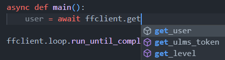

# First interaction with Foxford

Welcome to the first part of tutorial :D
<br>the usage of `Client` will be introduced here.

For the start we should import the important object — `foxford.Client`

```python
from foxford import Client
```

`Client` — tool for making request to foxford.ru API

## Typification

If you have the [nice IDE](recommended-ide.md) you can see the usage of client methods:



This will significantly speed up the development speed

As has already become clear from the picture above, to call a method, the `await` keyword is used, which is part of the python asynchronous implementation. Before continuing reading the tutorial, it is recommended to [read the official asyncio documentation](https://docs.python.org/3/library/asyncio.html) if you haven't done this.

## First request

Let's wrap our future request in a basic way of executing asynchronous code:

```python
import asyncio

async def main():
    ...

asyncio.run(main())
```
For the `Client` initialization, you need a `_fox_session` cookie (or how we call it "token")
And now, lets write the interaction:

```python
client = Client("cookie-token")
...
print(await client.get_user())
```

This request will get user's information (for example full name) and we will display it to our console using `print`

So, this is what we get:

```python
import asyncio
from foxford import Client

client = Client("cookie-token")

async def main():
    print(await client.get_user())

asyncio.run(main())
```
Also, instead of getting the cookie by our hands
we can use the `browser_cookie3` library with `Client.get_cookie(browser)` method, here's the example:
```python
from browser_cookie3 import Opera
from foxford import get_cookie
from foxford import Client
import asyncio

client = Client(get_cookie(Opera))

async def main():
    print(await client.get_user())

asyncio.run(main())
```
but instead of using `Opera` you should write the browser you use, if can't find your browser in `browser_cookie3` library then you can write your own just with `.load()` method, look at their [github](https://github.com/borisbabic/browser_cookie3) to find how to do that.

Congrats, after this know how to work with `Client`!

## Examples from this part of tutorial

* [basic.py](https://github.com/FrostX-Official/foxford/blob/main/examples/basic.py)