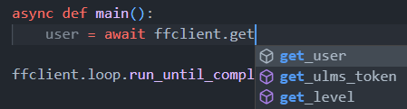

# Первое взаимодействие с Foxford

Добро пожаловать в первую часть туториала :D
<br>Здесь будет описано использование `Client`

Для начала нам следует импортировать важный объект — `foxford.Client`

```python
from foxford import Client
```

`Client` — инструмент для запроса к API foxford.ru

## Типизация

Если у вас есть [хорошая IDE](recommended-ide.md), вы можете увидеть использование методов клиента:



Это значительно ускорит скорость разработки.

Как уже стало понятно из картинки выше, для вызова метода используется ключевое слово await, которое является частью асинхронной реализации Python. Прежде чем продолжить чтение руководства, рекомендуется [прочитать официальную документацию asyncio](https://docs.python.org/3/library/asyncio.html), если вы этого еще не сделали.

## Первый запрос

Давайте обернем наш будущий запрос базовым способом выполнения асинхронного кода:

```python
import asyncio

async def main():
    ...

asyncio.run(main())
```
Для инициализации `Client` вам понадобится cookie `_fox_session` (или как мы его называем "token")
А теперь давайте напишем взаимодействие:

```python
client = Client("cookie-token")
...
print(await client.get_user())
```

Этот запрос получит информацию о пользователе (например, полное имя), и мы отобразим ее на нашей консоли, используя `print`.

Итак, вот что мы получаем:

```python
import asyncio
from foxford import Client

client = Client("cookie-token")

async def main():
    print(await client.get_user())

asyncio.run(main())
```
Вместо того, чтобы брать cookie вручную
мы можем использовать библиотеку `browser_cookie3` с методом `Client.get_cookie(browser)`, вот пример:
```python
from browser_cookie3 import Opera
from foxford import get_cookie
from foxford import Client
import asyncio

client = Client(get_cookie(Opera))

async def main():
    print(await client.get_user())

asyncio.run(main())
```
но вместо использования `Opera` вам следует написать браузер, который вы используете. Если вы не можете найти свой браузер в библиотеке `browser_cookie3`, вы можете написать свой собственный, просто используя метод `.load()`, посмотрите их [github](https://github.com/borisbabic/browser_cookie3), чтобы узнать, как это сделать.

Поздравляю, после этого вы умеете работать с `Client`!

## Примеры из этой части туториала

* [basic.py](https://github.com/FrostX-Official/foxford/blob/main/examples/basic.py)