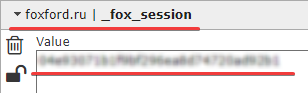

# Some answers to frequently asked questions

## asyncio

This section will contain a very concise and simple description of working with the **asyncio** module and simple recommendations on how to solve problems with locking.

## What is coroutine?

Coroutine is a function (coroutine) that must be called via **await**.

When code execution in Python reaches **await**, it stops execution in that function, and will return to it until will not execute other coroutines and will not exit this function.

Thanks to this approach, the program can perform several tasks concurrently without using threads,
and therefore, there will be savings in iron resources and high performance.

### Don't forget to write `await` before an `async` function, otherwise it won't run

```python
import asyncio

async def get_cat() -> str: return "cat"

async def main():
    print(get_cat())  # <coroutine object get_cat at 0x...>
    print(await get_cat())  # cat

asyncio.run(main())
```

## Where should I type await?

You need to write **await** only inside **async** functions and nowhere else.

```python
# bad
async def bar() -> str: return "bar"

def main():
    print(await bar()) 
    # Syntax ^ Error: 'await' outside async function

main()
```

```python
# bad
async def main():
    print("main")

await main()  # SyntaxError: 'await' outside function
```

```python
# good
import asyncio

async def bar() -> str: return "bar"

async def main():
    print(await bar())

asyncio.run(main())
```

## How to get client cookie

The easiest way is to use [EditThisCookie](https://chrome.google.com/webstore/detail/editthiscookie/fngmhnnpilhplaeedifhccceomclgfbg) extension (the cookie needed is `_fox_session`) otherwise you can use our `get_cookie(browser)` method.



## How to send request that doesn't exist in our framework

To send some custom fancy request use our `Client` method called `custom_request()`, here's the example of it's usage:

```python
from foxford import get_cookie
from foxford import Client
import asyncio

client = Client("token")

async def main():
    objectives = await client.custom_request(
        "GET", 
        "https://foxford.ru/api/user/objectives"
    )
    # print every objective from request
    for objective in objectives:
        print(f"Objective №{objectives.index(objective)+1}") # +1 cuz python lmao
        print("=================================")
        print(objective["title"])
        print(objective["subtitle"])
        print("=================================")

asyncio.run(main())
```
## Examples from this part of tutorial

* [custom_request.py](https://github.com/FrostX-Official/foxford/blob/main/examples/custom_request.py)